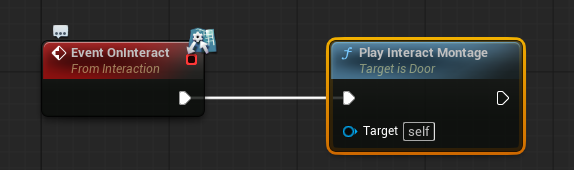
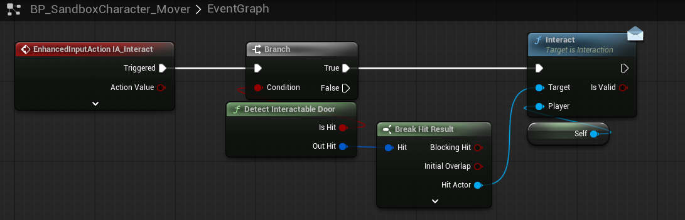
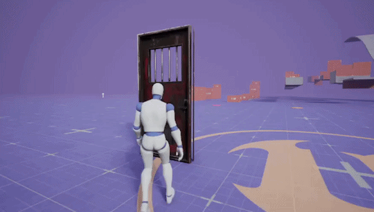
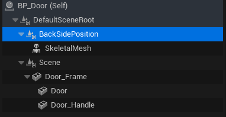
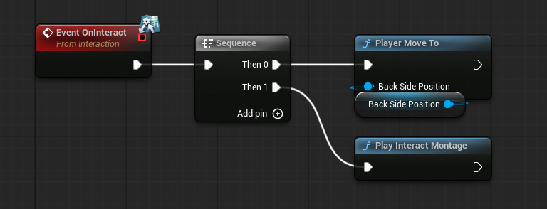
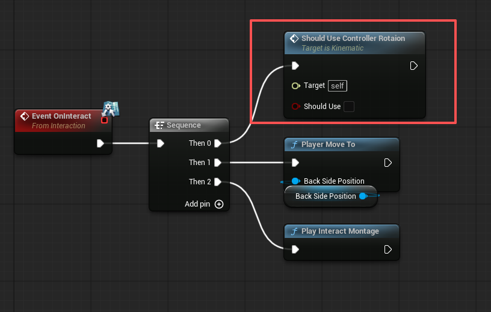
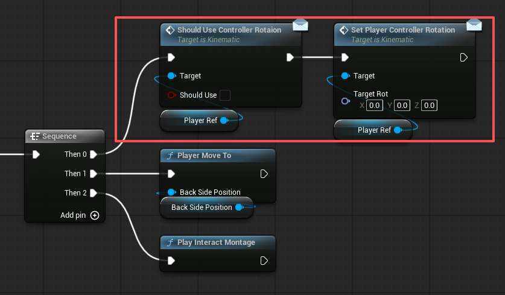

## 写在前面

### 接口迁移到C++声明

```cpp
#pragma once

#include "CoreMinimal.h"
#include "UObject/Interface.h"
#include "Interaction.generated.h"

UINTERFACE(BlueprintType)
class OPENDOORSYSTEM_API UInteraction : public UInterface
{
	GENERATED_BODY()
};

class OPENDOORSYSTEM_API IInteraction
{
	GENERATED_BODY()

public:

	UFUNCTION(BlueprintCallable, BlueprintImplementableEvent, Category="Interaction")
	void Interact(bool& IsValid);
};

```

然后在需要继承的类中继承该接口

```cpp
class OPENDOORSYSTEM_API ASandboxCharacter_Mover : public APawn, public IInteraction
{
```

回到基于这个类的蓝图类，就可以看到可以实现的接口


### 被实现的接口函数和普通类函数调用时的区别

|                    | 接口调用 (Interface)           | 类成员调用                                   |
| ------------------ | ------------------------------ | -------------------------------------------- |
| **定义位置** | 定义在 `IInterface` 派生类中 | 直接定义在 `AActor` / `UObject` 派生类中 |
| **关键字**   | `Execute_FunctionName`       | `FunctionName()`                           |
| **适用对象** | 任何实现了该接口的对象         | 必须是该类或其子类的实例                     |

## 交互门基本框架

### 接口Interaction

```cpp
public:

	//发出交互请求
	UFUNCTION(BlueprintCallable, BlueprintNativeEvent , Category="Interaction")
	void Interact(bool& IsValid, AActor* Player);

	//交互逻辑
	UFUNCTION(BlueprintNativeEvent)
	void OnInteract();

	//交互完成事件
	UFUNCTION(BlueprintNativeEvent)
	void OnInteractOver();

```

### 门类

```cpp
class OPENDOORSYSTEM_API ADoor : public AActor, public IInteraction

```

```cpp
protected:

	// 交互蒙太奇完成时回调函数
	UFUNCTION()
	void OnInteractMontageEnded(UAnimMontage* Montage, bool bInterrupted);

public:

	UPROPERTY(BlueprintReadWrite, Category="Interaction")
	bool IsInteractAllowed = true;
	UPROPERTY(BlueprintReadWrite, Category="Interaction")
	TObjectPtr<AActor> PlayerRef;

	UPROPERTY(BlueprintReadWrite, EditAnywhere, Category="Interaction|Montage")
	TObjectPtr<UAnimMontage> OpenLockedDoorMontage;

#pragma region IInteraction在Door的实现
	//交互请求(在Door的实现)
	UFUNCTION(BlueprintCallable, Category="Interaction")
	virtual void Interact_Implementation(bool& IsValid, AActor* Player) override;

	//交互逻辑(在Door的实现)
	UFUNCTION(BlueprintCallable, Category="Interact")
	virtual void OnInteract_Implementation() override;

	//交互完成事件
	UFUNCTION(BlueprintCallable, Category="Interact")
	virtual void OnInteractOver_Implementation() override;
#pragma endregion

	//播放交互蒙太奇
	UFUNCTION(BlueprintCallable, Category="Interaction|PlayMontage")
	void PlayInteractMontage();

```

```cpp
void ADoor::Interact_Implementation(bool& IsValid, AActor* Player)
{
	IInteraction::Interact_Implementation(IsValid, Player);

	if (!IsInteractAllowed)
	{
		return;
	}

	PlayerRef = Player;
	//执行交互逻辑事件
	Execute_OnInteract(this);

	//交互请求只发出一次
	IsInteractAllowed = false;
}

void ADoor::OnInteract_Implementation()
{
	IInteraction::OnInteract_Implementation();

}

void ADoor::OnInteractMontageEnded(UAnimMontage* Montage, bool bInterrupted)
{
	if (Montage != OpenLockedDoorMontage) return;
	//执行交互完成事件
	Execute_OnInteractOver(this);
}

void ADoor::OnInteractOver_Implementation()
{
	IInteraction::OnInteractOver_Implementation();

	//交互完成后：允许再次交互
	IsInteractAllowed = true;
	UKismetSystemLibrary::PrintString(this, TEXT("✅ 交互结束，可再次开门"));
}

void ADoor::PlayInteractMontage()
{
	if (!PlayerRef) return;

	USkeletalMeshComponent* PlayerMesh = PlayerRef->GetComponentByClass<USkeletalMeshComponent>();
	if (!PlayerMesh) return;

	UAnimInstance* AnimInstance = PlayerMesh->GetAnimInstance();
	if (!AnimInstance) return;

	if (!OpenLockedDoorMontage) return;

	// 执行动画
	AnimInstance->Montage_Play(OpenLockedDoorMontage);

	//绑定回调函数
	FOnMontageEnded EndDelegate;
	EndDelegate.BindUObject(this, &ADoor::OnInteractMontageEnded);
	AnimInstance->Montage_SetEndDelegate(EndDelegate, OpenLockedDoorMontage);
}
```

蓝图：



### 玩家类

```cpp
class OPENDOORSYSTEM_API ASandboxCharacter_Mover : public APawn, public IInteraction

```

```cpp
public:

	//检测可以交互的门
	UFUNCTION(BlueprintPure, Category = "Detect")
	void DetectInteractableDoor(bool& IsHit, FHitResult& OutHit);
```

```cpp
void ASandboxCharacter_Mover::DetectInteractableDoor(bool& IsHit, FHitResult& OutHit)
{
	FVector Start = this->GetActorLocation() + FVector(0, 0, 15);
	FVector End = Start + this->GetActorForwardVector() * 100;
	IsHit = UKismetSystemLibrary::SphereTraceSingle(this, Start, End, 20, TraceTypeQuery1, false, TArray<AActor*>(), EDrawDebugTrace::ForOneFrame, OutHit, true);
}
```

蓝图：



效果：



## 在角色播放蒙太奇之前走到合适的触发位置上

#### 接口Kinematic

```cpp
#pragma once

#include "CoreMinimal.h"
#include "UObject/Interface.h"
#include "Kinematic.generated.h"

UINTERFACE(BlueprintType)
class OPENDOORSYSTEM_API UKinematic : public UInterface
{
	GENERATED_BODY()
};

class OPENDOORSYSTEM_API IKinematic
{
	GENERATED_BODY()

public:

	//移动
	UFUNCTION(BlueprintCallable, BlueprintNativeEvent , Category="Kinematic")
	void MoveTo(FVector TargetLoc, FRotator TargetRot);
};

```

### 玩家类

```cpp
class OPENDOORSYSTEM_API ASandboxCharacter_Mover : public APawn, public IInteraction, public IKinematic

```

```cpp
#pragma region IKinematic在玩家类的实现
	//角色移动
	UFUNCTION(BlueprintCallable, Category="Interaction")
	virtual void MoveTo_Implementation(AActor* Player, FVector TargetLoc, FRotator TargetRot) override;
#pragma endregion
```

```cpp
void ASandboxCharacter_Mover::MoveTo_Implementation(FVector TargetLoc, FRotator TargetRot)
{
	IKinematic::MoveTo_Implementation(TargetLoc, TargetRot);

	// 构造 LatentActionInfo
	FLatentActionInfo LatentInfo;
	LatentInfo.CallbackTarget = this; 
	LatentInfo.ExecutionFunction = FName("OnMoveCompleted"); 
	LatentInfo.Linkage = 0; 
	LatentInfo.UUID = 100;

	UKismetSystemLibrary::MoveComponentTo(
		GetRootComponent(), 
		TargetLoc, 
		TargetRot, 
		true,              // bEaseOut
		true,              // bEaseIn
		0.5f,               // OverTime
		false,              // bForceShortestRotationPath
		EMoveComponentAction::Move, 
		LatentInfo
	);

}
```

### 门类

```cpp
class OPENDOORSYSTEM_API ADoor : public AActor, public IInteraction, public IKinematic
```

```cpp
	//玩家移动到目标点位
	UFUNCTION(BlueprintCallable, Category="Interaction|MoveTo", meta = (HideSelfPin = "true"))
	void PlayerMoveTo(USceneComponent* BackSidePosition);
```

```cpp
void ADoor::PlayerMoveTo(USceneComponent* BackSidePosition)
{
	FVector TargetLoc = BackSidePosition->GetComponentLocation();
	TargetLoc.Z = PlayerRef->GetActorLocation().Z;	//目标位置的z轴高度保持玩家自身的属性不变

	FRotator TargetRot = BackSidePosition->GetComponentRotation();

	Execute_MoveTo(PlayerRef, TargetLoc, TargetRot);
}
```

蓝图中新建一个目标点位，设置好Position和Rotation



在事件蓝图中播放蒙太奇之前让玩家移动到该点位



## 限制玩家鼠标移动

> PlayerMoveTo前阻止玩家鼠标移动，交互完成时(也就是OnInteractOver时)恢复鼠标移动

### 接口Kinematic

```cpp
	//限制鼠标旋转
	UFUNCTION(BlueprintCallable, BlueprintNativeEvent, Category="IKinematic")
	void ShouldUseControllerRotaion(bool ShouldUse);
```

### 玩家类

```cpp
	//限制鼠标旋转
	UFUNCTION(BlueprintCallable, Category="IKinematic")
	virtual void ShouldUseControllerRotaion(bool ShouldUse) override;
```

```cpp
void ASandboxCharacter_Mover::ShouldUseControllerRotaion_Implementation(bool ShouldUse)
{
	IKinematic::ShouldUseControllerRotaion_Implementation(ShouldUse);

	bUseControllerRotationYaw = ShouldUse;
}
```


### 门类

交互刚开始时禁止玩家鼠标旋转



交互完成事件恢复玩家鼠标旋转

```cpp
void ADoor::OnInteractOver_Implementation()
{
	IInteraction::OnInteractOver_Implementation();

	//允许再次交互
	IsInteractAllowed = true;
	//允许玩家控制鼠标旋转
	Execute_ShouldUseControllerRotaion(PlayerRef, true);

	UKismetSystemLibrary::PrintString(this, TEXT("✅ 交互结束，可再次开门"));
}
```

## 修复：玩家到达目标点时的控制器朝向错误

### 接口Kinematic

```cpp
	//设置玩家控制器的朝向
	UFUNCTION(BlueprintCallable, BlueprintNativeEvent, Category="IKinematic")
	void SetPlayerControllerRotation(FRotator TargetRot);
```

### 玩家类

```cpp
	//设置玩家控制器的朝向
	UFUNCTION(BlueprintCallable, Category="IKinematic")
	virtual void SetPlayerControllerRotation_Implementation(FRotator TargetRot) override;

```

```cpp
void ASandboxCharacter_Mover::SetPlayerControllerRotation_Implementation(FRotator TargetRot)
{
	IKinematic::SetPlayerControllerRotation_Implementation(TargetRot);

	GetController()->SetControlRotation(TargetRot);
}
```

### 门类


