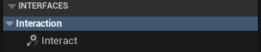

## 接口迁移到C++声明

```cpp
#pragma once

#include "CoreMinimal.h"
#include "UObject/Interface.h"
#include "Interaction.generated.h"

UINTERFACE(BlueprintType)
class OPENDOORSYSTEM_API UInteraction : public UInterface
{
	GENERATED_BODY()
};

class OPENDOORSYSTEM_API IInteraction
{
	GENERATED_BODY()

public:

	UFUNCTION(BlueprintCallable, BlueprintImplementableEvent, Category="Interaction")
	void Interact(bool& IsValid);
};

```

然后在需要继承的类中继承该接口

```cpp
class OPENDOORSYSTEM_API ASandboxCharacter_Mover : public APawn, public IInteraction
{
```

回到基于这个类的蓝图类，就可以看到可以实现的接口


